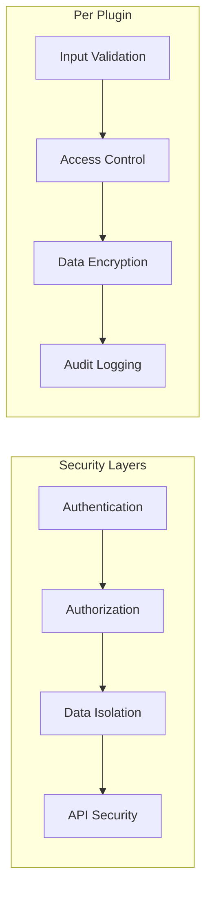
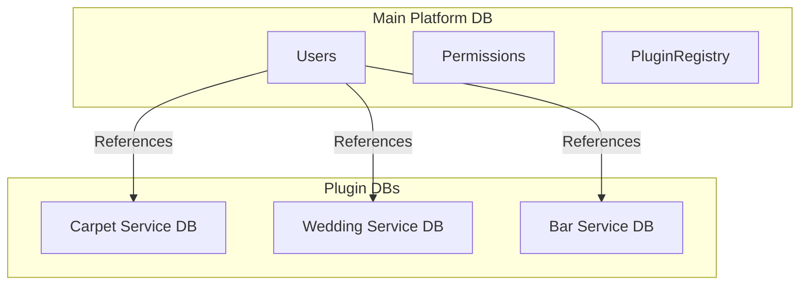
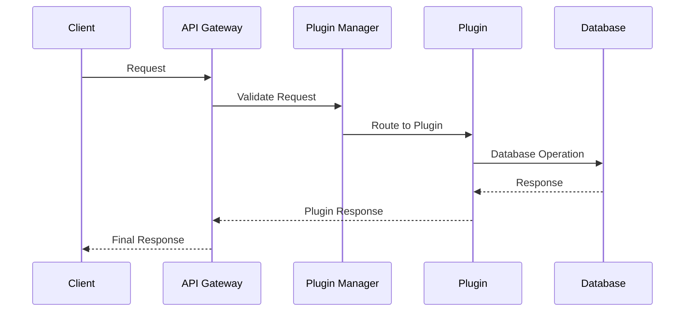
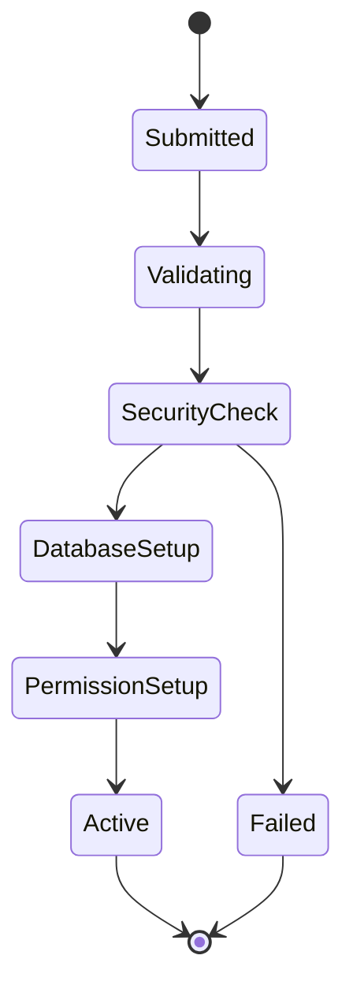

# Smart Service Platform - Architecture Diagram

## Component Details

### Platform Core
- **Plugin Manager**: Central system for plugin lifecycle management
- **Security Validator**: Ensures plugin security compliance
- **Version Handler**: Manages plugin versions and updates
- **API Gateway**: Routes requests to appropriate plugins
- **Authentication**: Handles user authentication and authorization
- **Database Manager**: Manages database isolation and connections

### Service Plugins
Each plugin operates independently with:
- Isolated database
- Dedicated API endpoints
- Custom business logic
- Specific UI components
- Service-specific features

### Access Control
1. **Platform Owner**
   - Full system access
   - Plugin management
   - Business verification
   - Security monitoring

2. **Business Owner**
   - Service-specific access
   - Limited to verified services
   - Employee management
   - Business operations

3. **Employees**
   - Task-specific access
   - Limited functionality
   - Managed by business owner

### Security Implementation

### Database Architecture

## Communication Flow

## Plugin Installation Flow

This architecture ensures:
- Secure multi-tenancy
- Plugin isolation
- Scalability
- Maintainability
- Business separation
- Data protection 