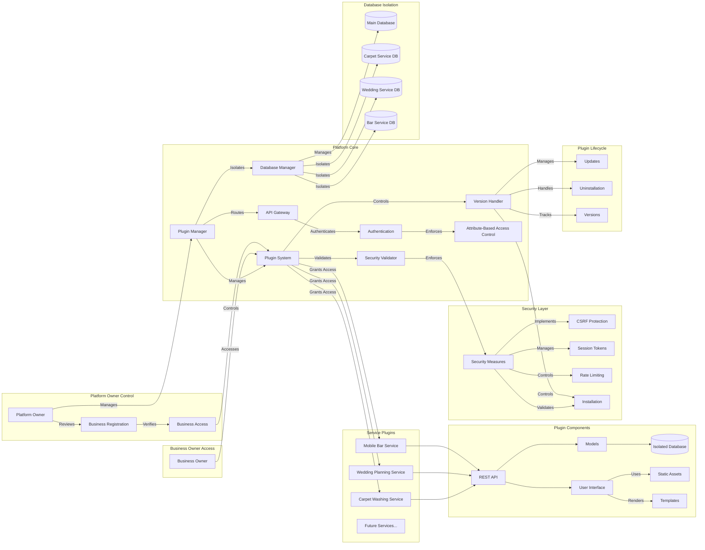

Name of the team: WizTech

Name of the project: SCCM (Smart Camera Carpet Measurements)

Members:

- Paul Lucian Pinzariu

# Smart Carpet Washing Service

The Smart Carpet Washing Service (SCW) is a comprehensive platform designed to streamline carpet washing operations. It features a modular architecture with a plugin-based system that allows for easy integration of additional services.

## Table of Contents
1. [Architecture Overview](#architecture-overview)
2. [Installation](#installation)
3. [Usage](#usage)
4. [BlueSky Presentation](BlueSky)

## Architecture Overview
For detailed architecture documentation, see:
- [ARCHITECTURE.md](ARCHITECTURE.md)
- [ARCHITECTURE_DIAGRAM.md](ARCHITECTURE_DIAGRAM.md)

## Installation
To install the Carpet Measurement App:
```bash
cd carpet-measure-app
pip install -r requirements.txt
python manage.py migrate
python manage.py runserver
```

## Usage

### Development Server
```bash
python manage.py runserver
```

### Admin Interface
1. Create a superuser:
```bash
python manage.py createsuperuser
```
2. Access the admin panel at: `http://localhost:8000/admin`

### Measurement Tool
1. Access the measurement interface at: `http://localhost:8000/measure`
2. Use the camera to capture carpet dimensions
3. View real-time measurements and generate QR codes

### Order Management
1. Create new orders through the dashboard
2. Track order status and priority
3. Generate delivery documents

### QR Code Generation
1. Scan QR codes to view product details
2. Generate new QR codes for items
3. Print QR codes for product labeling


## System Architecture Overview

